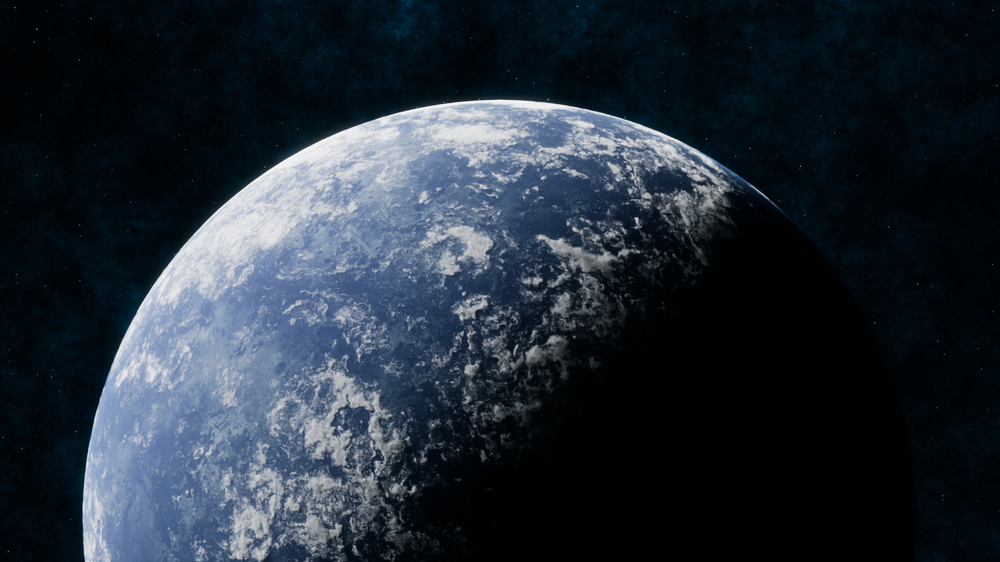

# Procedural Planet Project

## Project Overview

This Blender project involves creating a detailed and dynamic planet using procedural nodes. By leveraging Blender's powerful node-based system, this project generates a planet with realistic textures and features without the need for external image maps. The goal is to create a versatile and customizable planet that can be easily adjusted to represent various planetary types.

## Features

- **Fully Procedural Material**: Generate complex and realistic planetary surfaces using only procedural nodes.
- **Customizable Parameters**: Easily tweak parameters to change the appearance of the planet, including terrain, colors, and atmospheric effects.
- **Realistic Shading**: Use advanced shading techniques to simulate the planet's atmosphere, clouds, and surface details.
- **Animation Ready**: Suitable for static renders or animations, with controls for rotation and orbit.

## Customization

The procedural nature of this project allows for extensive customization. Key parameters include:

- **Terrain Features**: Adjust the scale and intensity of mountains, valleys, and other surface features.
- **Surface Colors**: Change the color scheme to represent different types of planets (e.g., Earth-like, desert, icy).
- **Atmospheric Effects**: Modify the density and color of the atmosphere to create different planetary environments.
- **Cloud Coverage**: Control the amount and type of clouds, including their movement for animations.

## Acknowledgements

Special thanks to [AlskanFx](https://www.youtube.com/@AlaskanFX) for the material.
